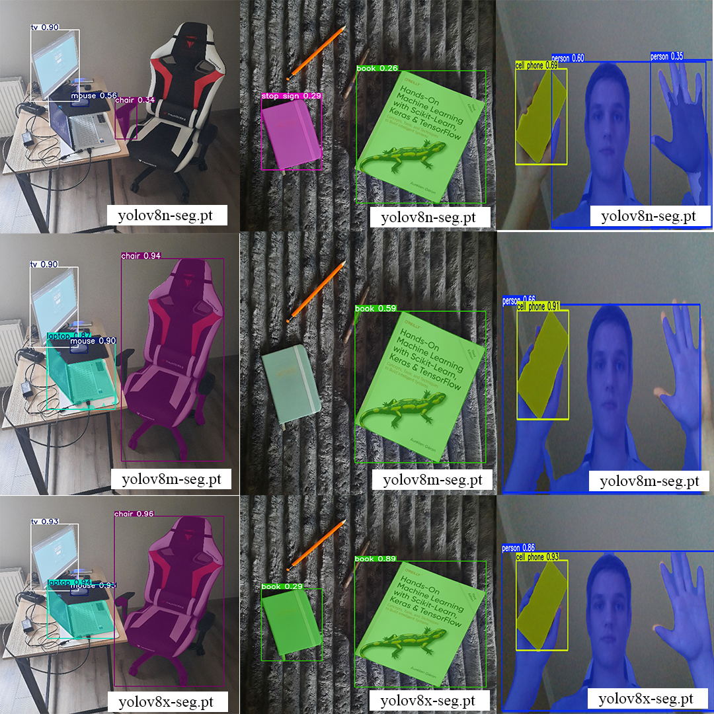
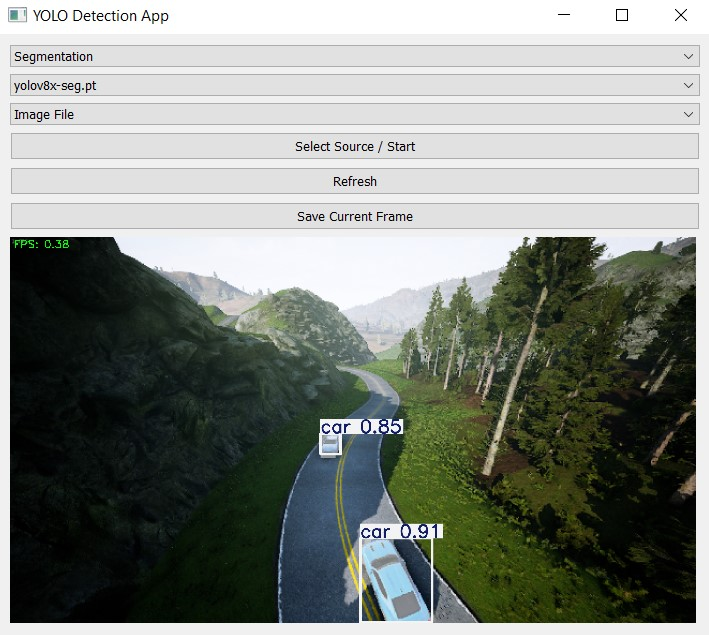

# 📘 Методи пошуку та розпізнавання об'єктів на основі YOLO

Програмна реалізація системи комп’ютерного зору на основі моделі YOLO з різними методами розпізнавання об'єктів.

ВАЖЛИВА ПРЕАМБУЛА! Файли нейромереж були частково (гітхаб репозиторій) або повністю (zip архів на платформі moodle) видалені, оскільки займають багато пам'яті і не можуть бути завантаженими. Їх можна завантажити з гугл-диску [за посиланням](https://drive.google.com/drive/folders/1sQFcjp4LRupaVlTY7DXcIzA9WqCXGyu3?usp=sharing). Без файлів нейромереж програми комп'ютерного зору не працюватимуть.

---

## 👤 Автор

- **ПІБ**: Григорук Денис
- **Група**: ФеІ-42
- **Керівник**: Ляшкевич Марія, асистент
- **Дата виконання**: 01.06.2025

---

## 📌 Загальна інформація

- **Тип проєкту**: GUI та CLI програми
- **Мова програмування**: Python 3.12
- **Фреймворки / Бібліотеки**: YOLO (Ultralytics), OpenCV, PyQt5.

---

## 🧠 Опис функціоналу

- Виявлення об’єктів на зображеннях, відео або з вебкамери
- Методи виявлення об'єктів, сегментації та оцінки положення за ключовими точками
- Запуск через CLI або GUI інтерфейс

---

## 🧱 Опис основних класів / файлів

| Клас / Файл     | Призначення |
|----------------|-------------|
| `gui/main_gui.py`      | Графічний інтерфейс для використання нейромереж |
| `detection/yolo_detect.py`    | консольна програма моделі виявлення об'єктів |
| `key_pose/run_model_pose.py` | консольна програма моделі оцінки положення за ключовими точками |
| `segmentation/yolo_segmentation.py` | консольна програма моделі сегментації |

---

## ▶️ Як запустити проєкт "з нуля"

### 1. Клонування репозиторію

```bash
git clone https://github.com/buldozer5647/dyplom.git
cd dyplom
```

### 2. Встановлення залежностей

```bash
conda create --name my-env --file requirements.txt
conda activate my-env
```

Якщо відсутній дистрибутив Anaconda

```bash
python -m venv env
env\Scripts\activate
pip install -r requirements.txt
```

### 3. Запуск

В залежності від бажаної моделі, обирається відповідний файл для запуску.

Для прикладу, програма моделі виявлення об'єктів запускається наступним чином:

```bash
python detection/yolo_detect.py --model yolov8n.pt --source test.jpg --resolution 1280x720
```

---

## 🔌 Приклади запуску програм

### Модель виявлення об'єктів

```bash
python detection/yolo_detect.py --model yolov8n.pt --source test.jpg --resolution 1280x720
```

### Модель сегментації об'єктів

```bash
python segmentation/yolo_segmentation.py
```

### Модель оцінки положення ключових точок

```bash
python key_pose/run_model_pose.py
```

### Модель виявлення об'єктів

```bash
python gui/main_gui.py
```


---

## 🖱️ Інструкція для користувача

### 🔧 CLI-програма: `detection/yolo_detect.py`

Програма запускається через командний рядок і приймає наступні аргументи:

- `--model` — шлях до файлу моделі (наприклад, `my_model.pt`). Якщо модель не знайдено або не вказано, за замовчуванням використовується `yolov8s.pt`.
- `--source` — джерело для виконання моделі:
  - зображення (`image.jpg`)
  - папка з зображеннями (`images/`)
  - відео (`video.mp4`)
  - індекс вебкамери (`0`)
  - індекс модульної камери Raspberry Pi (функціональність закладено на перспективу).
- `--thresh` — поріг достовірності для виводу результатів. Стандартне значення: `0.5`.
- `--resolution` — роздільна здатність у форматі `WxH` (наприклад, `1280x720`). Якщо не вказано — використовується розмір джерела.
- `--record` — при наявності цього параметра та заданої роздільної здатності результат буде записано у файл `demo1.avi`.

### 💻 GUI-програма: `gui/main_gui.py`

Графічний інтерфейс забезпечує просту взаємодію з моделлю YOLO через наступні елементи керування:

- Select Source / Start — вибір джерела обробки (вебкамера, зображення, відеофайл) та запуск моделі. Після запуску виконується обробка у реальному часі або разова (для зображень).
- Refresh — очищення інтерфейсу, зупинка відеопотоку, скидання виводу моделі. Використовується для перезапуску або зміни джерела без закриття програми.
- Save Current Frame — збереження поточного обробленого кадру з нанесеними результатами у файл (JPG або PNG). Відкривається діалогове вікно для вибору місця збереження.
- Model Type Selector — випадаючий список для вибору типу задачі YOLO:
  - Сегментація (`segmentation`)
  - Оцінка пози (`pose`)
- Model Selector — вибір вагової моделі, яка відповідає вибраному типу задачі. Доступні моделі:
  - `yolov8n-seg.pt`
  - `yolov8m-seg.pt`
  - `yolov8x-seg.pt`
  - `yolov8n-pose.pt`
- Source Selector — вибір джерела вхідних даних:
  - `Webcam` — потік з камери
  - `Image File` — одне зображення
  - `Video File` — відео з покадровою обробкою


---

## 📷 Приклади / скриншоти

- Модель сегментації об'єктів

- Графічний інтерфейс користувача


---


